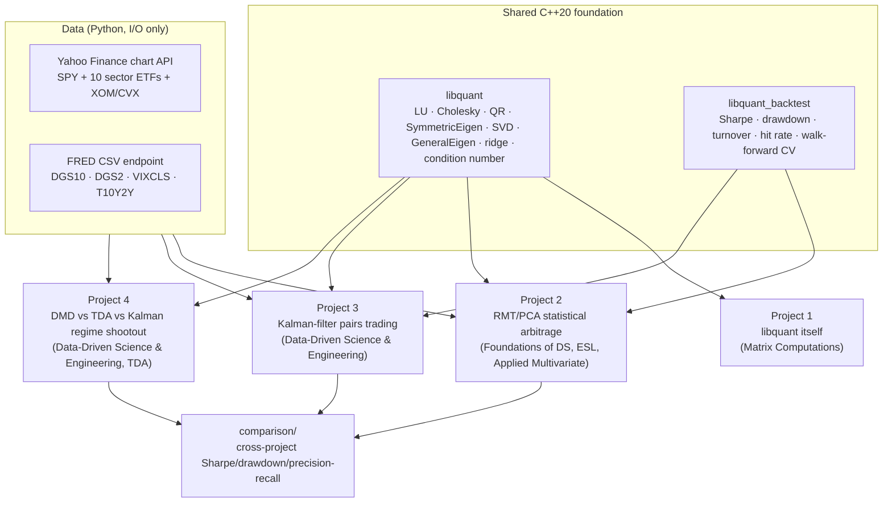

# Quant / ML Portfolio — From-Scratch Numerics, Applied to Real Markets

Four interrelated projects built on a single, hand-written, benchmarked
C++20 numerical linear algebra library — not a survey of many shallow
demos, but one shared foundation used to implement and honestly evaluate
four distinct quantitative research methodologies from graduate-level
texts, on real market data, with a walk-forward discipline that makes
look-ahead bias structurally impossible.

**Engineering position, stated plainly:** every algorithm here — LU,
Cholesky, QR, a symmetric eigensolver, a full Golub–Reinsch SVD, a general
(complex) eigensolver, Dynamic Mode Decomposition, Vietoris–Rips persistent
homology, a Kalman filter, Marchenko–Pastur random-matrix denoising — is
implemented from first principles in modern C++, not wrapped from a
library. Eigen is linked in exactly one place: as a correctness/performance
*oracle* in the test and benchmark suites, never in the implementation
itself. Python appears in exactly two places: fetching data over HTTP and
rendering matplotlib figures — never in a modeling or estimation path. That
split is enforced by convention and is auditable by grep in any project's
`src/`.

## Architecture



## The four projects

| # | Project | Core method | Books | Headline result |
|---|---|---|---|---|
| 1 | [`libquant`](libs/libquant) | LU/Cholesky/QR/SVD/eigensolvers from scratch, benchmarked vs. Eigen | *Matrix Computations* (Golub & Van Loan) | Within ~1.2–1.5x of Eigen at n=256 after a cache-locality fix the benchmark itself caught |
| 2 | [RMT/PCA stat-arb](projects/02-rmt-pca-stat-arb) | Marchenko–Pastur denoising → PCA eigenportfolios → OU s-score signal | *Foundations of Data Science*, *Elements of Statistical Learning*, *Applied Multivariate Statistical Analysis* | Textbook RMT eigenvalue spectrum; honestly flat Sharpe (−0.01) net of costs, market-neutral through 2008 & 2020 |
| 3 | [Kalman pairs trading](projects/03-kalman-pairs-control) | Time-varying hedge ratio vs. static-OLS baseline | *Data-Driven Science and Engineering* (Brunton & Kutz) | Adaptive estimation triples Sharpe (0.61 vs 0.17) and nearly halves drawdown vs. the static baseline |
| 4 | [Regime shootout](projects/04-regime-shootout) | DMD/Koopman vs. Vietoris–Rips persistent homology vs. Kalman innovation | *Data-Driven Science and Engineering*, *Topological Data Analysis with Applications* | Kalman innovation detects both 2008 & 2020 within 3–4 days; DMD lags by weeks; TDA underperforms — reported honestly, not hidden |

Each project's README derives its method's mathematics from first
principles, states exactly which book chapter it draws from, and reports
results — including negative or flat ones — with an explanation of *why*,
not just *what*.

## Why these four, and why they're interrelated

This is deliberately **not** one folder per book. `libquant` (Project 1) is
the literal foundation every other project links against — same `Matrix<T>`
type, same `SVD`, same `QR`. `libquant_backtest` gives Projects 2 and 3
identical Sharpe/drawdown/turnover formulas and an identical walk-forward
splitter, so their results in [`comparison/`](comparison) are genuinely
apples-to-apples rather than four unrelated demos with incompatible
conventions. Project 4 reuses Project 3's Kalman filter verbatim as one of
its three regime-detection baselines. The result is a portfolio that reads
as one coherent research program — build the numerical primitives once,
prove they're correct and fast, then spend every subsequent project on the
actual quantitative research question, not re-deriving `Ax=b`.

## Building

Requires a C++20 compiler (tested with GCC 14 / MinGW-w64 on Windows, and
should build equally with Clang or MSVC), CMake ≥ 3.21, and a build backend
(Ninja recommended). Eigen and Catch2 are pulled automatically via CMake
`FetchContent` on first configure — no manual dependency installation.

```
cmake -S . -B build -G Ninja -DCMAKE_BUILD_TYPE=Release
cmake --build build -j
ctest --test-dir build --output-on-failure
```

That builds and runs all four projects' C++ pipelines and their full unit
test suite (597 assertions across 47 test cases as of this writing, all
cross-checked against Eigen where a from-scratch/reference comparison
applies). Each project's `results/*.csv` are already committed, so the
figures embedded in every README can be regenerated without rebuilding:

```
python -m venv .venv
.venv\Scripts\pip install -r requirements.txt        # pandas, requests, matplotlib, numpy
.venv\Scripts\python data\fetch\fetch_yahoo.py        # optional: re-fetch data
.venv\Scripts\python data\fetch\fetch_fred.py
.venv\Scripts\python projects\02-rmt-pca-stat-arb\plots\make_plots.py
.venv\Scripts\python projects\03-kalman-pairs-control\plots\make_plots.py
.venv\Scripts\python projects\04-regime-shootout\plots\make_plots.py
.venv\Scripts\python comparison\aggregate_metrics.py
```

## Engineering notes worth a recruiter's five minutes

- **The benchmark suite caught a real bug.** `libquant`'s first LU
  implementation was 42x slower than Eigen at n=256 — not because the
  algorithm was wrong, but because its loop order jumped `rows_` elements
  per step against column-major storage. Reordering to a rank-1-update form
  closed the gap to ~1.2x. See [Project 1's README](libs/libquant) for the
  before/after numbers.
- **Every from-scratch numerical component is cross-checked against
  Eigen** in the test suite — SVD, the symmetric and general eigensolvers,
  QR, ridge regression, condition-number estimation — not just tested
  against hand-derived toy cases (though those exist too, e.g. persistent
  homology against an exact unit-square computation).
- **Negative and flat results are reported, not massaged.** Project 2's
  near-zero Sharpe and Project 4's weak TDA precision are both real
  findings, explained rather than hidden — the value of the portfolio is
  in demonstrating the methodology is implemented and evaluated correctly,
  not in every result being a win.
- **Look-ahead bias is structural, not a promise.** `libquant_backtest`'s
  walk-forward splitter makes a test window strictly follow its training
  window by construction; Project 3's static-vs-adaptive comparison and
  Project 4's crisis-window evaluation both make explicit which threshold
  decisions are diagnostic-only versus genuinely out-of-sample.

## License

MIT — see [LICENSE](LICENSE).
