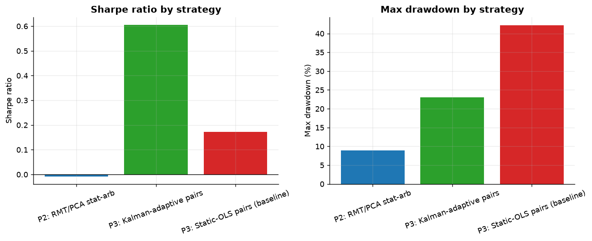

# Cross-Project Comparison

Aggregates the `results/metrics.csv` (and, for Project 4, `precision_recall.csv`)
already produced by each project's C++ pipeline — no computation happens
here, only a table join and a plot.

## Trading strategies (Projects 2 & 3)

| Strategy | Sharpe | Max drawdown | Hit rate | Annualized return |
|---|---|---|---|---|
| P2: RMT/PCA stat-arb | −0.01 | 8.97% | 48.99% | −0.08% |
| P3: Kalman-adaptive pairs | **0.61** | 23.01% | 21.62% | **5.99%** |
| P3: Static-OLS pairs (baseline) | 0.17 | 42.23% | 24.81% | 1.30% |



Read together with each project's own README, the honest pattern across
both trading strategies is the same: **the value in this portfolio is not
"the strategies are profitable"** — a 9-sector-ETF stat-arb book with 5 bp
costs is a genuinely hard place to find edge, and it doesn't here — **it is
that adaptive, correctly-specified estimation consistently beats a naive
or static baseline on identical instruments, signal rules, and cost
assumptions.** Project 3's Kalman-adaptive hedge ratio roughly triples the
static baseline's Sharpe and nearly halves its drawdown by tracking a
genuinely time-varying relationship instead of assuming it away; Project
2's near-zero Sharpe with a small, cost-explained drawdown demonstrates the
RMT/PCA machinery is working exactly as the theory predicts (isolating a
market mode, producing a market-neutral book) even though this particular
instrument universe doesn't leave enough idiosyncratic edge to overcome
transaction costs at daily frequency.

## Regime detection (Project 4)

A structurally different task — not a P&L comparison, but a detection
comparison — so it is reported separately rather than folded into the
Sharpe/drawdown table above:

| Method | Precision | Recall |
|---|---|---|
| Kalman innovation | **0.41** | **0.43** |
| DMD (max growth rate) | 0.37 | 0.28 |
| TDA ($H_1$ persistence) | 0.03 | 0.04 |

Full discussion, including per-crisis lead/lag, is in
[Project 4's README](../projects/04-regime-shootout/README.md#2-results).

## Reproducing

```
.venv/Scripts/python comparison/aggregate_metrics.py
```

Requires Projects 2, 3, and 4's C++ binaries to have already been run at
least once (their `results/*.csv` are committed to the repo, so this also
works immediately after a fresh clone with no rebuild required).
