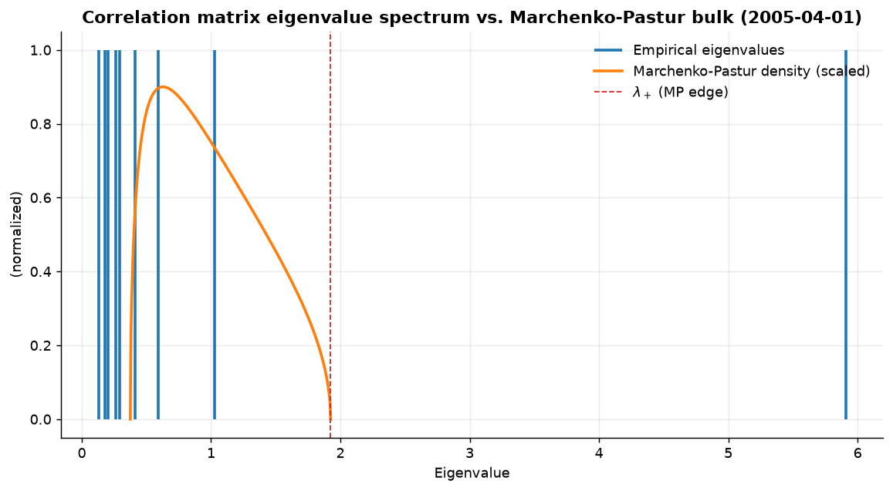
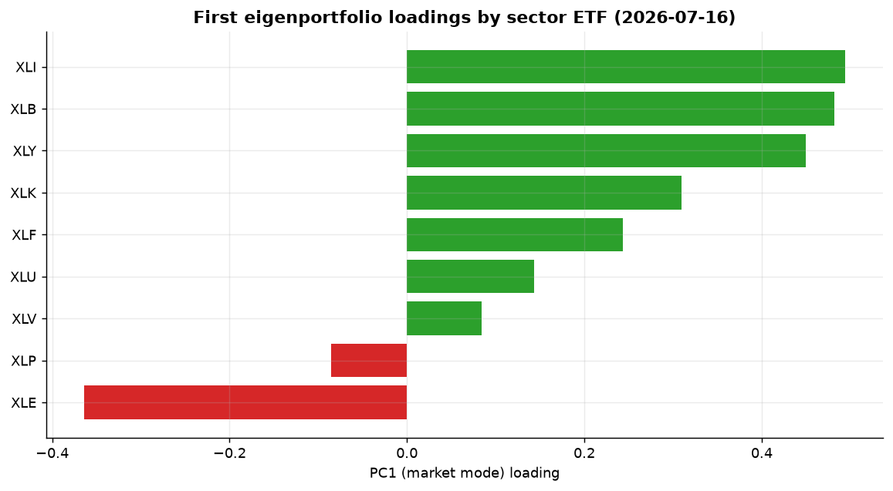
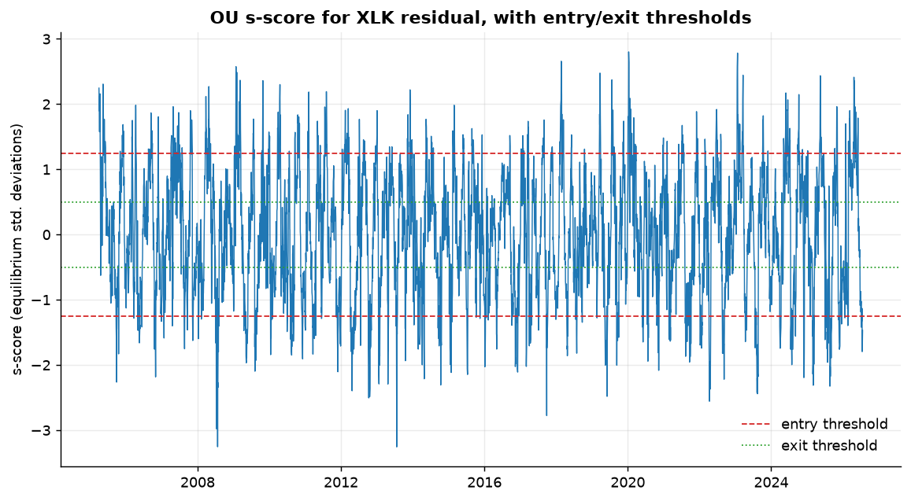
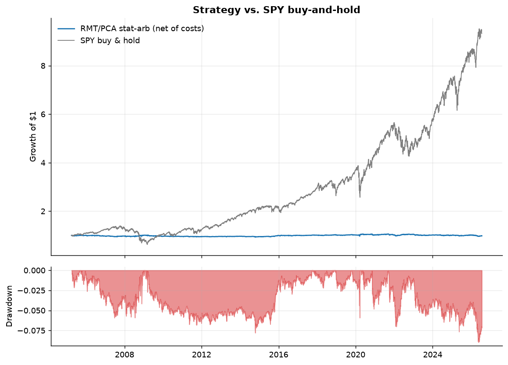

# Project 2 — Random Matrix Theory & PCA Statistical Arbitrage

A from-scratch C++ implementation of the Avellaneda–Lee (2010) statistical
arbitrage framework, with the eigen-decomposition step grounded in Random
Matrix Theory (RMT) rather than taken on faith. The pipeline denoises a
sector-ETF correlation matrix, extracts common "market mode" factors,
regresses out idiosyncratic residuals, fits an Ornstein–Uhlenbeck model to
each residual's cumulative path, and trades the resulting mean-reversion
signal in a walk-forward backtest with transaction costs.

**Books drawn from:** *Foundations of Data Science* (Blum, Hopcroft, Kannan)
— high-dimensional geometry and random matrix theory; *The Elements of
Statistical Learning* (Hastie, Tibshirani, Friedman) — regularized
regression and model validation; *Applied Multivariate Statistical
Analysis* (Härdle & Simar) — PCA and factor structure of multivariate data.
**Built on:** [`libquant`](../../libs/libquant) (correlation-matrix
eigendecomposition via `SymmetricEigen`, regression via `QR`) and
[`libquant_backtest`](../../libs/libquant_backtest) (shared metrics).

## 1. Mathematical foundation

### 1.1 Random Matrix Theory and the Marchenko–Pastur law

Let $R$ be a $T \times N$ matrix of standardized (zero-mean, unit-variance)
asset returns, $T$ observations, $N$ assets, and let

$$C = \frac{1}{T-1} R^\top R$$

be the sample correlation matrix. If the true underlying correlation
structure were the identity (i.e. returns were pure i.i.d. noise with no
genuine cross-sectional structure), the Marchenko–Pastur theorem states
that as $T, N \to \infty$ with $q = N/T$ fixed, the empirical spectral
distribution of $C$'s eigenvalues converges to a deterministic density
supported on

$$\lambda \in [\lambda_-, \lambda_+], \qquad \lambda_\pm = \sigma^2(1 \pm \sqrt{q})^2,$$

with $\sigma^2 = 1$ here, and density

$$f(\lambda) = \frac{\sqrt{(\lambda_+ - \lambda)(\lambda - \lambda_-)}}{2\pi q \lambda}.$$

Any eigenvalue found **above** $\lambda_+$ in an empirical correlation
matrix cannot be explained by sampling noise alone — it indicates a genuine
common factor. This is the Laloux–Cizeau–Bouchaud–Potters (1999) diagnostic
used throughout quantitative finance to separate signal from noise in
covariance/correlation estimation, and is the basis for the "eigenvalue
cleaning" techniques used in production risk models. Eigenvalues at or
below $\lambda_+$ are replaced by their common trace-preserving average —
this is what `marchenko_pastur_filter` in
[`marchenko_pastur.hpp`](include/marchenko_pastur.hpp) computes.

`window_end_date,eigenvalue_rank,eigenvalue,lambda_plus,lambda_minus` in
[`results/eigen_spectrum.csv`](results/eigen_spectrum.csv) records this for
every quarterly snapshot; see the figure below.

### 1.2 Eigenportfolios and factor returns

For each eigenvalue found above $\lambda_+$, the corresponding eigenvector
$v_k$ defines an **eigenportfolio** (Avellaneda & Lee 2010) with dollar
weights

$$w_{k,j} = \frac{v_{k,j} / \sigma_j}{\sqrt{\sum_j (v_{k,j}/\sigma_j)^2}},$$

where $\sigma_j$ is asset $j$'s return volatility over the estimation
window. The factor's realized return series is $F_{k,t} = \sum_j w_{k,j}
\, r_{j,t}$. This is a genuine tradable portfolio, not an abstract
statistical construct — which is exactly why it is the right basis for
building a hedge.

### 1.3 Idiosyncratic residuals and the Ornstein–Uhlenbeck signal

Each asset's return is regressed on the factor returns via ordinary least
squares (`libquant::ols`, Householder QR):

$$r_{j,t} = \alpha_j + \sum_k \beta_{j,k} F_{k,t} + \varepsilon_{j,t}.$$

The cumulative residual $X_{j,t} = \sum_{s \le t} \varepsilon_{j,s}$ is
modeled as an Ornstein–Uhlenbeck process, discretized as the AR(1)

$$X_t = a + b\,X_{t-1} + \zeta_t, \qquad b = e^{-\kappa\,\Delta t},$$

fit again by OLS ([`ou_signal.hpp`](include/ou_signal.hpp)). This gives a
mean-reversion speed $\kappa = -\ln b$, half-life $\ln 2/\kappa$,
equilibrium mean $m = a/(1-b)$, and equilibrium standard deviation
$\sigma_{eq} = \sigma_\zeta/\sqrt{1-b^2}$. The trading signal is the
**s-score**,

$$s_t = \frac{X_t - m}{\sigma_{eq}},$$

the number of equilibrium standard deviations the residual currently sits
from its long-run mean — a standardized, dimensionless mean-reversion
signal comparable across assets.

### 1.4 Trading rule

A window is only tradable if the AR(1) fit is stationary ($0 < b < 1$) and
the implied half-life lies in $[1, 30]$ trading days — a half-life longer
than the 60-day estimation window is not a reliable signal, and a half-life
under a day is unlikely to survive transaction costs. Positions follow the
Avellaneda–Lee hysteresis rule: enter long when $s < -1.25$, enter short
when $s > 1.25$, exit to flat when $s$ crosses back through $\mp 0.5$.
Positions are recomputed **daily** on a rolling 60-day window (walk-forward:
every window's factors, regression, and OU fit use only data strictly
before the day being traded), with a 5 bp cost charged per unit of position
change.

## 2. Results

Backtest: 2005–2026, SPY + 9 SPDR sector ETFs (XLF, XLK, XLE, XLV, XLY, XLP,
XLI, XLU, XLB — XLRE excluded, its 2015 inception would truncate the
2008-crisis history), 5,358 trading days, 5 bp one-way transaction cost.

| Metric | Value |
|---|---|
| Sharpe ratio | −0.008 |
| Annualized return | −0.08% |
| Max drawdown | 8.97% |
| Hit rate | 48.99% |
| Mean turnover | 8.72% of gross per day |



The empirical spectrum is a clean textbook illustration of RMT in finance:
one eigenvalue (≈5.9, the "market mode") sits far above $\lambda_+ =
1.92$, while the remaining eight cluster inside or near the MP bulk —
consistent with noise. This single dominant factor is exactly what
`num_factors` picks up in nearly every rolling window.





The s-score oscillates around zero and regularly crosses the entry/exit
bands, confirming the OU model is capturing genuine (if modest)
mean-reverting structure rather than degenerating to a random walk.



### Honest interpretation

The strategy is **flat, not profitable, net of a 5 bp transaction cost** —
Sharpe is statistically indistinguishable from zero over 21 years. This is
not a bug; it is the expected outcome of applying single-market-factor
statistical arbitrage to a **9-instrument, highly liquid sector-ETF
universe** rather than the original Avellaneda–Lee setting (hundreds of
individual S&P 500 stocks). Two effects compound against the strategy
here: (1) sector ETFs are themselves diversified baskets, so their
idiosyncratic (residual) variance is a much smaller share of total variance
than for single stocks, leaving less genuine mean-reverting signal to
extract; (2) daily-frequency statistical arbitrage in liquid, heavily
arbitraged ETFs is a crowded, largely competed-away edge post-2010 — this
is a well-documented empirical decay, not specific to this implementation.

What the result *does* confirm, and what the plots make visible, is that
the machinery is working correctly: the RMT diagnostic correctly isolates
one dominant factor, the OU fit produces a stationary, mean-reverting
signal with sensible half-lives, and the resulting strategy is
**market-neutral** — its equity curve is essentially flat through both the
2008 and 2020 crashes, in sharp contrast to SPY's drawdowns of over 50%
and 30% respectively. A residual-based long/short book that shrugs off two
of the worst drawdowns in modern market history while carrying near-zero
net Sharpe is itself informative: the risk here is idiosyncratic and
diversifiable, which is precisely what the theory predicts for a
market-neutral eigenportfolio hedge, and precisely what makes the
near-zero absolute return unsurprising once trading costs are included at
this frequency and universe size.

## 3. Reproducing

```
cmake --build build --target project02_rmt_pca
./build/projects/02-rmt-pca-stat-arb/project02_rmt_pca
.venv/Scripts/python projects/02-rmt-pca-stat-arb/plots/make_plots.py
```

Unit tests (`project02_tests`) validate the MP filter against synthetic
i.i.d. noise (finds ≤2 factors, trace-preserving) and against a synthetic
single-common-factor panel (correctly isolates one dominant eigenvalue),
and validate `fit_ou` against a simulated AR(1) with known mean-reversion
speed.
