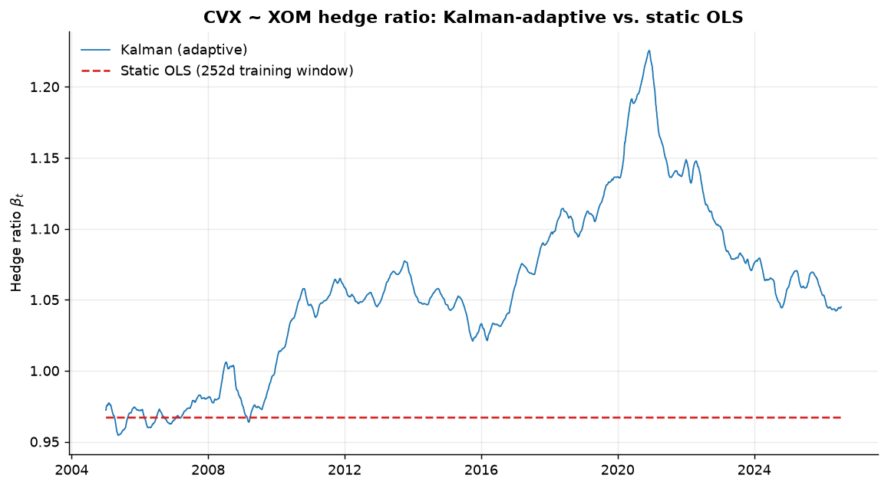
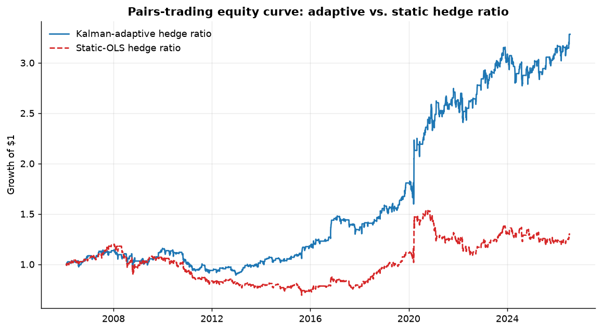
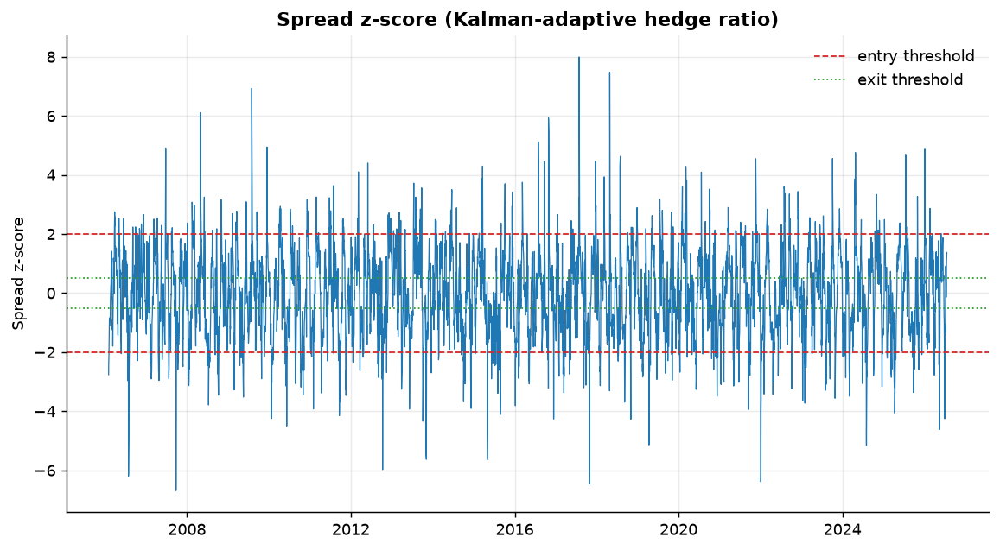

# Project 3 — Kalman-Filter Pairs Trading vs. a Static-OLS Baseline

A from-scratch C++ implementation comparing a **time-varying** hedge ratio,
estimated online with a Kalman filter, against a **static** hedge ratio
fit once by ordinary least squares — on the identical instrument pair,
identical out-of-sample period, and identical backtest engine, so the
comparison isolates the value of adaptive estimation itself.

**Books drawn from:** *Data-Driven Science and Engineering* (Brunton &
Kutz) — optimal state estimation / the Kalman filter, framed here through
its least-squares interpretation; *Applied Multivariate Statistical
Analysis* (Härdle & Simar) — the regression and residual-based
cointegration testing this is built on. **Built on:**
[`libquant`](../../libs/libquant) (`QR`-based OLS) and
[`libquant_backtest`](../../libs/libquant_backtest) (shared metrics).

## 1. Mathematical foundation

### 1.1 Cointegration and the Engle-Granger test

Two price series $P_A, P_B$ are cointegrated if some linear combination of
them is stationary even though each series individually is not (a unit
root / random walk). The Engle-Granger two-step procedure: (1) regress
$\log P_A = \beta \log P_B + u$ by OLS; (2) test the residual $u_t$ for a
unit root via an augmented Dickey-Fuller regression,

$$\Delta u_t = \gamma\, u_{t-1} + \phi\, \Delta u_{t-1} + e_t,$$

implemented in [`adf_test.hpp`](include/adf_test.hpp) directly on top of
`libquant::ols`. The null hypothesis $\gamma = 0$ is a unit root (no
cointegration); rejecting in favor of $\gamma < 0$ means $u_t$ is mean
reverting. Because $u_t$ is itself an estimated residual, its t-statistic
does **not** follow the standard Dickey-Fuller distribution — this project
uses the asymptotic MacKinnon (1994/2010) critical values for the
2-variable, no-constant Engle-Granger residual test
($-3.90/-3.34/-3.04$ at 1%/5%/10%), hard-coded rather than re-derived from
MacKinnon's full finite-sample response-surface regression, which is
explicitly out of scope for this project.

### 1.2 The Kalman filter as a recursive least-squares estimator

Model the hedge ratio as a latent state following a random walk, observed
through a linear, noisy relationship:

$$\beta_t = \beta_{t-1} + w_t, \quad w_t \sim N(0, Q), \qquad y_t = \beta_t x_t + v_t, \quad v_t \sim N(0, R).$$

Given a prior $\hat\beta_{t-1}, P_{t-1}$, the predict step propagates the
random walk: $\hat\beta_{t|t-1} = \hat\beta_{t-1}$, $P_{t|t-1} = P_{t-1} +
Q$. The update step combines this prediction with the new observation
$y_t$ by minimizing the posterior variance:

$$e_t = y_t - x_t \hat\beta_{t|t-1}, \qquad S_t = x_t^2 P_{t|t-1} + R,$$

$$K_t = \arg\min_K \; \operatorname{Var}\big[(1-Kx_t)\hat\beta_{t|t-1} + K y_t\big] = \frac{P_{t|t-1}\,x_t}{S_t},$$

$$\hat\beta_t = \hat\beta_{t|t-1} + K_t e_t, \qquad P_t = (1 - K_t x_t)\,P_{t|t-1}.$$

$K_t$ is exactly the weight that makes $\hat\beta_t$ the minimum-variance
unbiased combination of the prior and the observation — the same
optimality principle behind weighted least squares, applied recursively
one observation at a time rather than by re-solving a growing normal-equations
system from scratch. Implemented in
[`kalman_filter.hpp`](include/kalman_filter.hpp).

### 1.3 Signal and hysteresis rule

For either hedge-ratio estimate, the spread $u_t = \log P_{A,t} - \beta_t
\log P_{B,t}$ is standardized by its trailing 20-day mean/std into a
z-score. Positions follow the same hysteresis rule as Project 2: enter
when $|z| > 2$, exit to flat when $|z|$ crosses back through $0.5$, with a
5 bp cost per unit of position change.

## 2. Results

Instrument pair: XOM / CVX (log prices), 2005–2026, static hedge ratio
fit on the first 252 trading days, both methods traded identically over
the remaining ~20 years.

**Cointegration test:** Engle-Granger ADF t-stat = **−0.51** (5% critical
value −3.34) → **not cointegrated** over the full sample at conventional
significance.

| Method | Sharpe | Max drawdown | Annualized return |
|---|---|---|---|
| Kalman-adaptive | **0.61** | **23.0%** | **6.0%** |
| Static OLS (252d) | 0.17 | 42.2% | 1.3% |







### Honest interpretation

The formal Engle-Granger test says XOM and CVX are **not** cointegrated
over the full 2005–2026 sample — and the hedge-ratio plot shows exactly
why: $\beta_t$ drifts from about 0.97 in 2005 to a peak near 1.23 around
2021 before partially reverting, a clear structural non-stationarity
rather than a fixed long-run relationship. A textbook cointegration-based
pairs trade, which assumes a *fixed* linear relationship, is therefore not
well justified here by the strict theory — and the static-OLS baseline's
performance (Sharpe 0.17, a 42% drawdown, essentially flat 2011–2019) is
consistent with trading a relationship that quietly stopped holding.

The more interesting and more honest finding is what the Kalman filter
recovers *despite* that: by continuously re-estimating $\beta_t$ instead
of assuming it is constant, the adaptive strategy tracks the drifting
relationship well enough to produce a materially better risk-adjusted
return (Sharpe 0.61 vs. 0.17) and roughly half the drawdown, on the exact
same pair, signal rule, and cost assumptions. This is not a claim that
XOM/CVX exhibit textbook cointegration — it is a demonstration that
**online, minimum-variance adaptive estimation is robust to exactly the
kind of slow parameter drift that breaks a static-relationship
assumption**, which is the practical argument for using a Kalman filter
(or any online estimator) over a one-shot regression in a live trading
system, independent of whether the underlying relationship satisfies a
formal stationarity test.

### Scope note

An optimal-execution LQR extension (discrete-time Riccati recursion,
Almgren–Chriss style) was considered as a secondary demonstration of
control theory but is deliberately out of scope for this delivery — the
Kalman-filter estimation comparison above is this project's core,
completed result.

## 3. Reproducing

```
cmake --build build --target project03_kalman_pairs
./build/projects/03-kalman-pairs-control/project03_kalman_pairs
.venv/Scripts/python projects/03-kalman-pairs-control/plots/make_plots.py
```

Unit tests (`project03_tests`) validate `KalmanFilter1D` against a
synthetic constant-beta system (converges to the true value) and its
steady-state gain against the closed-form discrete Riccati fixed point,
and validate `adf_test` against both a synthetic stationary AR(1) series
(correctly rejects the unit-root null) and a synthetic pure random walk
(correctly fails to reject it).
