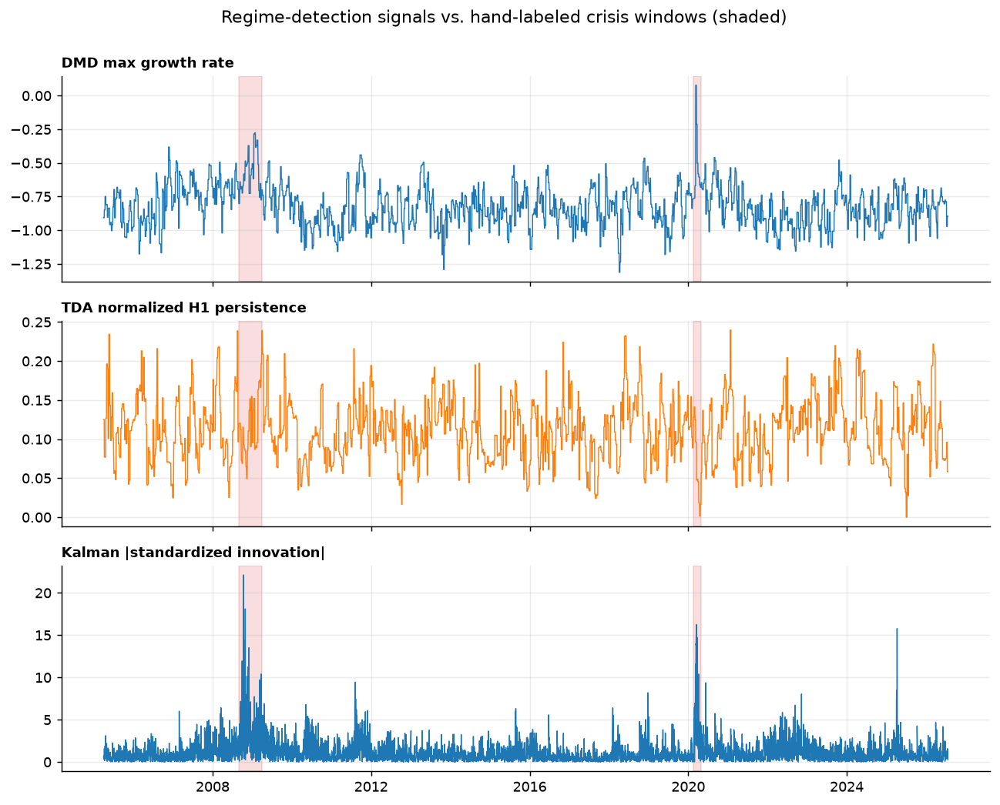
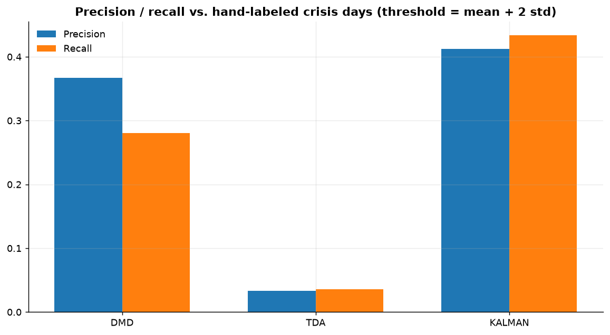

# Project 4 — Regime-Detection Shootout: DMD vs. TDA vs. Kalman Innovation

Three theoretically distinct methods — dynamical-systems spectral analysis
(DMD/Koopman), algebraic topology (persistent homology), and Bayesian
filtering (Kalman innovation) — applied to the **same instruments, same
rolling-window discipline, same evaluation protocol**, and scored against
hand-labeled crisis windows (2008 GFC, 2020 COVID). This is the explicit
cross-method comparison this portfolio was built around: not "which method
is best in the abstract," but which one actually detects a regime break in
this data, and how quickly.

**Books drawn from:** *Data-Driven Science and Engineering* (Brunton &
Kutz) — Dynamic Mode Decomposition and the Koopman operator; *Topological
Data Analysis with Applications* (Carlsson & Vejdemo-Johansson) — Vietoris–
Rips complexes and persistent homology. **Built on:**
[`libquant`](../../libs/libquant) (`SVD`, `GeneralEigen`) and reuses
Project 3's [`KalmanFilter1D`](../03-kalman-pairs-control/include/kalman_filter.hpp).

## 1. Mathematical foundation

### 1.1 Dynamic Mode Decomposition and the Koopman operator

Given a sequence of system snapshots $x_1, \dots, x_m \in \mathbb{R}^n$
(here, the daily return vector of 9 sector ETFs), assemble $X = [x_1
\cdots x_{m-1}]$ and $X' = [x_2 \cdots x_m]$. Exact DMD (Tu et al. 2014)
seeks the best-fit linear operator $A$ with $X' \approx AX$ in a
reduced coordinate system: with $X = U\Sigma V^\top$ (`libquant::SVD`,
truncated to rank $r$ by a 99% cumulative-energy threshold),

$$\tilde{A} = U_r^\top X' V_r \Sigma_r^{-1} \in \mathbb{R}^{r\times r}.$$

The eigenvalues $\mu_i$ of $\tilde{A}$ (`libquant::GeneralEigen`, via
Faddeev–LeVerrier + Durand–Kerner — see [Project 1](../../libs/libquant))
are exactly $A$'s non-trivial eigenvalues. Under the **Koopman operator**
interpretation, $A$ is a finite-dimensional approximation of the (generally
infinite-dimensional) linear operator that advances *observables* of the
true, possibly nonlinear, dynamics — so DMD eigenvalues approximate the
leading Koopman eigenvalues even when the underlying market dynamics are
nonlinear. Each $\mu_i$ maps to a continuous-time growth rate $\omega_i =
\ln(\mu_i)/\Delta t$; $\operatorname{Re}(\omega_i) > 0$ means that mode is
*expanding* — locally unstable dynamics, the signature of a regime break.
This project tracks $\max_i \operatorname{Re}(\omega_i)$ over rolling
60-day windows (step 5 days) as the DMD instability signal.

### 1.2 Persistent homology of a Takens-embedded return series

SPY's daily log returns are time-delay (Takens) embedded into
$\mathbb{R}^3$: $p_i = (r_i, r_{i+1}, r_{i+2})$, turning a scalar series
into a geometric point cloud whose shape reflects the dynamics' recurrence
structure. A **Vietoris–Rips complex** is built on this cloud
([`persistent_homology.hpp`](include/persistent_homology.hpp)): points
within $\varepsilon$ of each other are joined by an edge, and any three
mutually-within-$\varepsilon$ points span a filled triangle. As $\varepsilon$
grows from 0, this produces a filtration of simplicial complexes;
**persistent homology** tracks, for each dimension, when topological
features (dimension 0: connected components; dimension 1: independent
loops) are born and die. The standard reduction algorithm
(Edelsbrunner–Letscher–Zomorodian) computes this by reducing the boundary
matrix over $\mathbb{Z}/2$ via column operations, pairing each "death"
simplex with the "birth" simplex whose class it kills.

Each rolling 60-day window (step 5 days, 58-point embedded cloud) is
processed at $\varepsilon$ = the 15th percentile of pairwise distances
(a k-NN-style sparsification), and the **maximum $H_1$ persistence**
(longest-lived loop, normalized by the window's median pairwise distance
for scale invariance across volatility regimes) is tracked as the
topological-complexity signal. Two exact test cases validate the
implementation: a unit square produces one $H_1$ feature with birth $= 1$
and death $= \sqrt 2$ exactly; a filled equilateral triangle produces none.

### 1.3 Kalman-innovation monitor

Reuses [Project 3's `KalmanFilter1D`](../03-kalman-pairs-control/README.md#12-the-kalman-filter-as-a-recursive-least-squares-estimator)
verbatim, called with $x_t \equiv 1$: the observation model $y_t = \beta_t
\cdot 1 + v_t$ collapses to a local-level tracker, $\text{level}_t =
\text{level}_{t-1} + w_t$, $y_t = \text{level}_t + v_t$, applied to SPY's
daily return. The standardized innovation $|e_t|/\sqrt{S_t}$ — how many
filter-implied standard deviations today's return sits from the currently
tracked level — is a simple CUSUM-style break statistic: any day whose
return is unusually large relative to recent behavior lights it up
immediately, with no rolling-window lag.

### 1.4 Evaluation protocol

Ground truth: two hand-labeled crisis windows, **2008-09-01 to 2009-03-31**
(Lehman collapse through the market bottom) and **2020-02-20 to
2020-04-30** (COVID crash through the initial recovery). Each signal is
thresholded at its own full-sample mean $+\ 2$ standard deviations — a
diagnostic "how unusual is this" cutoff appropriate for a *descriptive*
regime-detection comparison. (Using a full-sample threshold would be
look-ahead bias in a trading strategy; here it is not one — Projects 2 and
3 are the trading strategies, with their walk-forward and out-of-sample
discipline enforced by `libquant_backtest`. This project's threshold is
explicitly a comparison-only diagnostic, not a signal a strategy would
trade on.) Precision/recall are computed against crisis-day labels, and
lead/lag is the date of each method's first flag inside a crisis window
minus the window's official start date.

## 2. Results

| Method | Precision | Recall | GFC lag (days) | COVID lag (days) |
|---|---|---|---|---|
| **Kalman innovation** | **0.41** | **0.43** | **+3** | **+4** |
| DMD (max growth rate) | 0.37 | 0.28 | +56 | +19 |
| TDA ($H_1$ persistence) | 0.03 | 0.04 | +203 | never flagged |





### Honest interpretation

The Kalman-innovation monitor — the simplest of the three methods by a
wide margin — wins decisively on every metric, flagging both crises within
3–4 days of their official start. This makes sense: the crises in question
were, in return-magnitude terms, defined by a small number of extreme
single-day moves (the September 2008 and March 2020 crashes are visible as
sharp spikes directly in the third panel above), and a standardized-
innovation statistic is close to the most direct possible detector of
"today's move is statistically extreme relative to recent behavior."

DMD detects both crises with reasonable precision but at real lag (56 and
19 days) — expected, since it needs a full 60-day window of altered
dynamics to shift its dominant eigenvalue's growth rate meaningfully, and
is measuring something structurally different (cross-sectional dynamical
coupling among the 9 sectors, not any one asset's return magnitude).

TDA is the weakest performer here, and that result should be reported
honestly rather than explained away: at the chosen embedding (3D Takens,
delay 1), window (60 days), and sparsification (15th-percentile
$\varepsilon$), normalized $H_1$ persistence does not clearly separate
crisis from non-crisis periods for SPY returns — the signal in the top
panel of the timeline figure is visibly noisy throughout, without a clean
elevation during either shaded crisis window. The most likely explanation
is that large *directional* market drawdowns don't necessarily correspond
to more topologically "looping" short-term return dynamics in this
particular embedding — TDA's stated strength is detecting cyclic/recurrent
structure, which is a different signature than a fast, one-directional
crash. This is a legitimate negative result and a natural direction for
further work (a different embedding dimension/delay, a volatility or
correlation-matrix-derived point cloud rather than raw returns, or a
persistence-entropy statistic instead of max persistence), not a
implementation defect — the two closed-form geometric tests confirm the
persistent-homology computation itself is exact.

## 3. Reproducing

```
cmake --build build --target project04_regime_shootout
./build/projects/04-regime-shootout/project04_regime_shootout
.venv/Scripts/python projects/04-regime-shootout/plots/make_plots.py
```

Unit tests (`project04_tests`) validate `compute_dmd` against a synthetic
linear system with known eigenvalues (a damped rotation matrix) and
against a pure-decay system (correctly negative growth rate), and validate
persistent homology against two exact closed-form cases (unit square: one
$H_1$ feature, birth $=1$, death $=\sqrt2$; equilateral triangle: none)
plus a relative comparison (a pentagon ring vs. a tight point cluster).
